<!--
  Kajal Mishra
  Design: Apple · Linear · Notion · Muji · Vercel
  Palette: white · black · sage
-->

 

  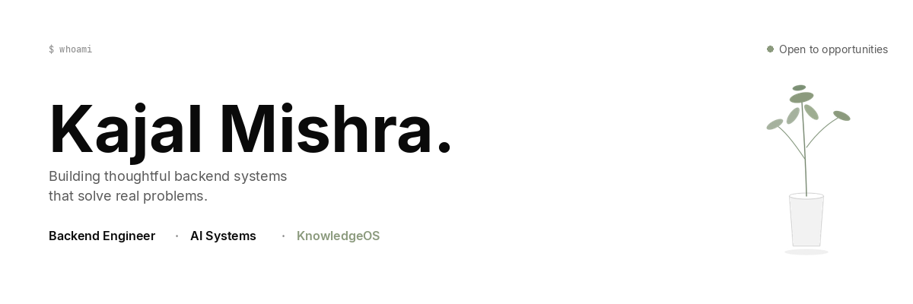

 

  
  &nbsp;&nbsp;
  
  &nbsp;&nbsp;
  
  &nbsp;&nbsp;
  

 
 
 

<table>
  <tr>
    <td width="42%" valign="top">

 

## About

 

I enjoy building the parts of software users rarely notice — but rely on every day.

APIs, databases, backend systems, architecture. The quiet layers underneath. My curiosity usually starts there: how something works, where it breaks, and what would make it calmer under load.

That same curiosity led me to KnowledgeOS. I wanted a place where notes and half-finished thoughts could actually answer me back.

 
 

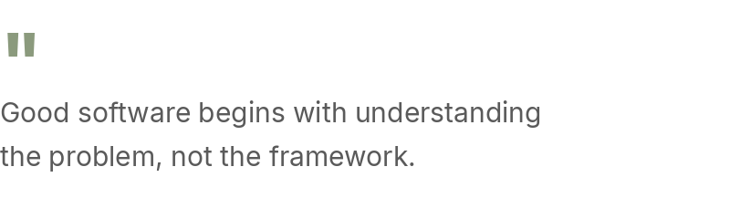

 

</td>
    <td width="8%"></td>
    <td width="50%" valign="top">

 

## Currently Building

 

<a href="https://github.com/kajalmishra-dev/knowledgeos">
  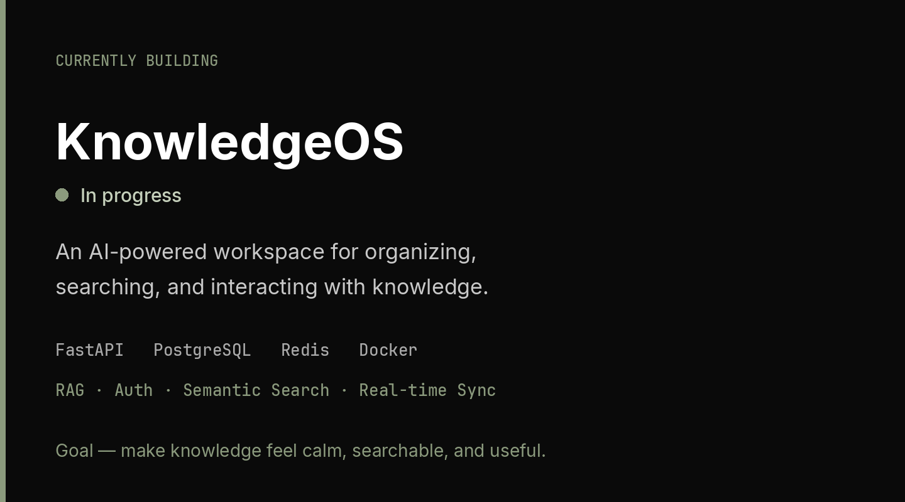
</a>

 

</td>
  </tr>
</table>

 
 
 

## Selected work

 

<table>
  <tr>
    <td width="48%" valign="top">
      <a href="https://github.com/kajalmishra-dev/knowledgeos">
        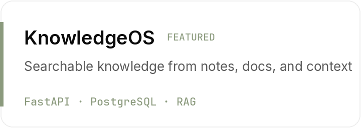
      </a>
    </td>
    <td width="4%"></td>
    <td width="48%" valign="top">
      <a href="https://github.com/kajalmishra-dev/isi-ds-erp-portal">
        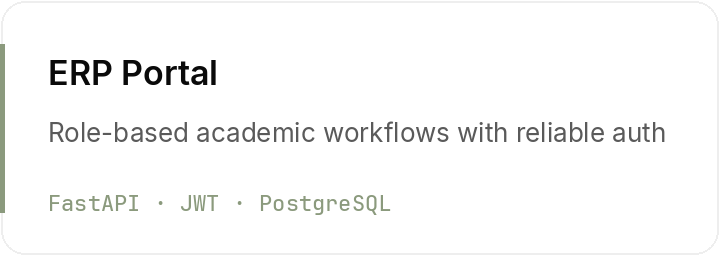
      </a>
    </td>
  </tr>
</table>

 

<table>
  <tr>
    <td width="48%" valign="top">
      <a href="https://github.com/kajalmishra-dev/isi-ds-insightai">
        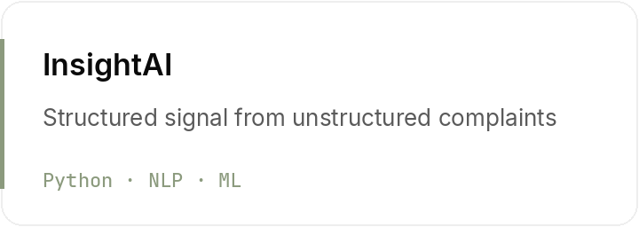
      </a>
    </td>
    <td width="4%"></td>
    <td width="48%" valign="top">
      <a href="https://github.com/kajalmishra-dev/finflow-expense-tracker">
        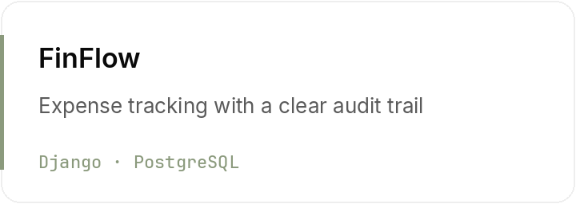
      </a>
    </td>
  </tr>
</table>

 
 

  

 
 
 

## Craft

 

<table>
  <tr>
    <td width="36%" valign="top">

### Stack

 

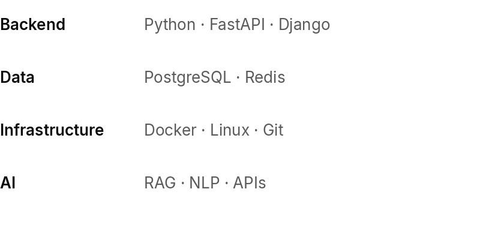

</td>
    <td width="5%"></td>
    <td width="28%" valign="top">

### Learning

 

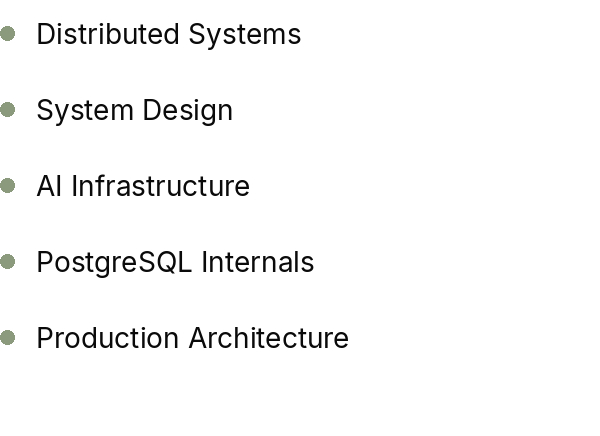

</td>
    <td width="5%"></td>
    <td width="26%" valign="top">

### Beyond

 

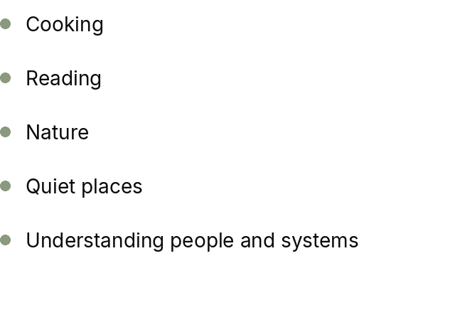

</td>
  </tr>
</table>

 
 
 

## Direction

 

  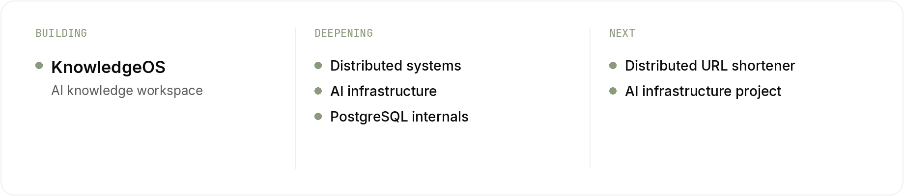

 
 
 
